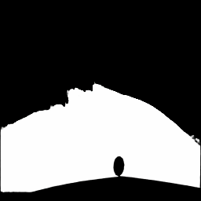
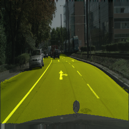

# Vision-Based Road Detection using FCN

## Overview
The main purpose of this work is to develop a component of self-driving car that can be used for road detection. An input for this component is a single RGB image, and an output is a mask that shows road areas in the image. I employed Fully Convolutional Network (FCN) that is known to be significantly useful for semantic segmentation. However, such techniques require massive efforts to generate a large dataset that has ground truth.

Now, state-of-the-art object detection algorithms show great performance, so I believe that pixel-level segmentation for every objects is not always necessary for practical applications. So I developed an FCN-based approach that focuses only on road, that cannot be dealt with the conventional object detection algorithms. The annotation efforts can be significantly reduced if we can limit the region of interest only to road.

## FCN Architecture
I employed the following architecture for FCN.

## Setup
### Prerequisites
- Linux
- Python 3.5
- numpy
- PyTorch 0.4.1
- OpenCV

All these modules area quite popular, so you can easily find how to install them on the Internet.

## Datasets
Currently, I assume that the model is trained and tested on [The Cityscapes Dataset](https://www.cityscapes-dataset.com/). Download the following two packages. (You need to make an account.)
- [gtFine_trainvaltest.zip (241MB)](https://www.cityscapes-dataset.com/file-handling/?packageID=1)
- [leftImg8bit_trainvaltest.zip (11GB)](https://www.cityscapes-dataset.com/file-handling/?packageID=3)

Unzip and place them under `./datasets/cityscapes` as follows:

```
datasets/

　└ cityscapes/

　　　├ gtFine_trainvaltest/

　　　└ leftImg8bit_trainvaltest/
```

Call `preprocess.py` to create training and validation data.
```
python preprocess.py
```
This will create 2,975 training images and 500 validation images in `./datasets/cityscapes/train` and `./datasets/cityscapes/val`, respectively.

## Train
```
python train.py
```
During training, models and sample results are saved to `./saved_models` and `./images`, respectively. Use `-h` to see options.

It will take around 3 min. for 1 epoch using NVIDIA GeForce GTX 1080 Ti.

## Test
```
python test.py --model model_path
```
This will run the model named `model_path` on all images in `./datasets/cityscapes/val`. Result images are saved to `./results`.

You will find the following two types of images in `./results`. The left image is an output (mask) of the FCN and the right image highlights the detected road area in the input image. These images are saved as `result_*.png` and `synthesized_*.png`, respectively.



## Model and Results
You can download the [pre-trained model](https://drive.google.com/file/d/1y4S01h-KgVb6GOclDghxDUp-N9sFJMrk/view?usp=sharing) (after 50 epochs) and the [results](https://drive.google.com/file/d/13xPr2wO7lGTkQjrF8cHbFU79avthyjH2/view?usp=sharing) generated by the model.
